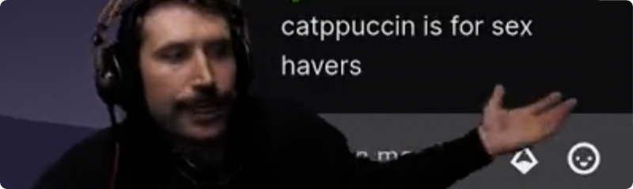

&nbsp;

<h3 align="center">
  
</h3>

&nbsp;

  Hi, I’m Lemon! 👋 
  Helping the internet stay usable, beautiful, and slightly less on fire.

&nbsp;

  <a href="https://github.com/catppuccin/catppuccin"><picture></picture></a>
  <a href="https://github.com/unseen-ninja/palette"><picture><source srcset="./assets/images/pin-palette-dark.svg" media="(prefers-color-scheme: dark)" /><source srcset="./assets/images/pin-palette-light.svg" media="(prefers-color-scheme: light), (prefers-color-scheme: no-preference)" /></picture></a><a href="https://github.com/unseen-ninja/website"><picture><source srcset="./assets/images/pin-website-dark.svg" media="(prefers-color-scheme: dark)" /><source srcset="./assets/images/pin-website-light.svg" media="(prefers-color-scheme: light), (prefers-color-scheme: no-preference)" /></picture></a>

&nbsp;
